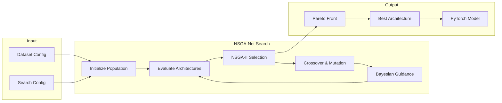
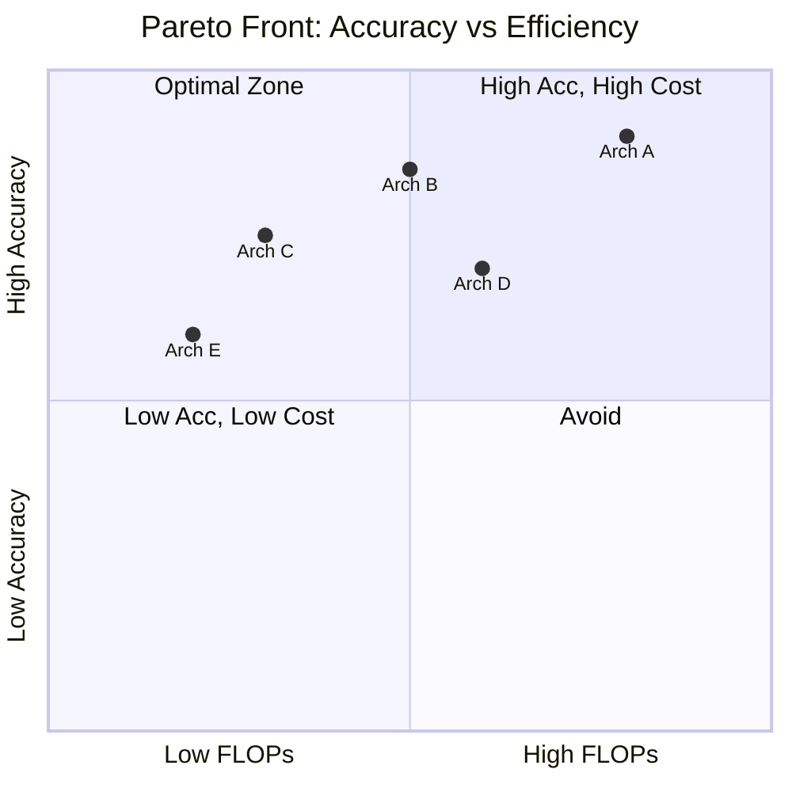
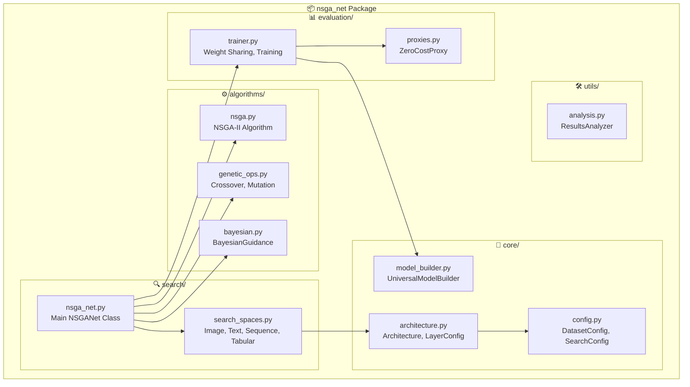
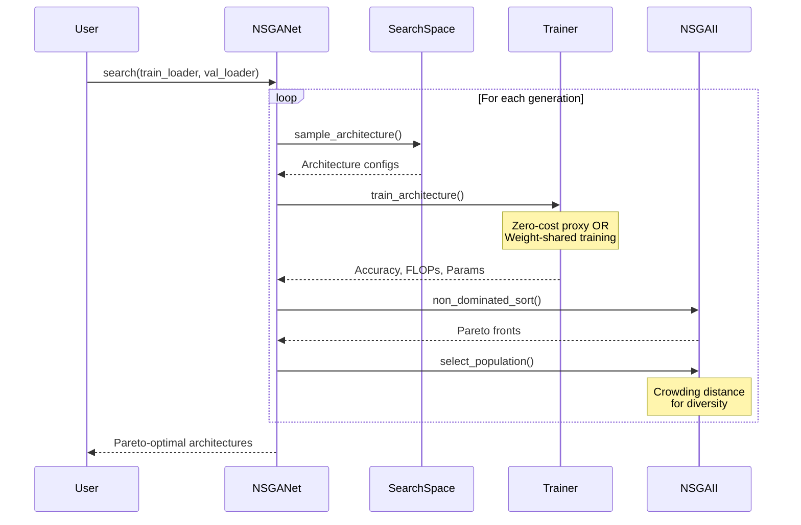

# MO-NAS: Multi-Objective Neural Architecture Search

[](https://www.python.org/downloads/)
[](https://pytorch.org/)

A production-ready framework for automatically discovering optimal neural network architectures using **NSGA-II multi-objective optimization**.

## ✨ Features

- 🎯 **Multi-Objective**: Accuracy, FLOPs, Parameters, Latency, Memory
- 📊 **Multi-Modal**: Image, Text, Sequence, Tabular data
- ⚡ **Zero-Cost Proxies**: Fast evaluation without training
- 🧠 **Bayesian Guidance**: Surrogate model for efficiency
- 🔄 **Weight Sharing**: Reduced training cost
- 🏗️ **Modular Design**: Easy to extend

---

## � How It Works



---

## 🎯 Multi-Objective Optimization

NSGA-Net finds the **Pareto-optimal** trade-off between competing objectives:



---

## 🏗️ Architecture



---

## 📦 Installation

```bash
python3 -m venv venv
source venv/bin/activate
pip install -r requirements.txt
```

## 🚀 Quick Start

```python
from nsga_net import DatasetConfig, SearchConfig, NSGANet, UniversalModelBuilder

# Configure
dc = DatasetConfig('image', (3, 224, 224), 1000)
sc = SearchConfig(population_size=20, generations=30)

# Search
nsga = NSGANet(dc, sc)
pareto = nsga.search(train_loader, val_loader)

# Get best & build model
best = nsga.get_best_architecture(pareto, 'balanced')
model = UniversalModelBuilder.build_model(best)
```

---

## 🔬 Search Process



---

## 🎨 Supported Data Types

| Type | Input Shape | Search Space | Examples |
|------|-------------|--------------|----------|
| 🖼️ **Image** | `(C, H, W)` | Conv, Pool, Skip | CIFAR-10, ImageNet |
| 📝 **Text** | `seq_length` | LSTM, GRU, Transformer | Sentiment, NER |
| 📈 **Sequence** | `(seq, features)` | RNN, Dense | Time Series, Stock |
| 📊 **Tabular** | `num_features` | Dense, Dropout, BN | Credit, Fraud |

---

## ⚙️ Configuration

```python
SearchConfig(
    population_size=20,         # Number of architectures per generation
    generations=30,             # Evolution iterations
    max_flops=1000,             # FLOPs limit (millions)
    max_memory_mb=8000,         # GPU memory limit
    use_zero_cost_proxy=True,   # Fast evaluation
    use_bayesian_guidance=True, # Surrogate model
)
```

---

## 📁 Project Structure

```
MO-NAS/
├── nsga_net/                    # Main package
│   ├── __init__.py             # Public API
│   ├── core/                    # Core components
│   ├── algorithms/              # Optimization algorithms
│   ├── evaluation/              # Evaluation utilities
│   ├── search/                  # Search components
│   └── utils/                   # Utilities
├── main.py                      # Demo entry point
├── requirements.txt             # Dependencies
└── README.md                    # This file
```

---

## 🏃 Run Demo

```bash
python main.py
```

## 📤 Export Results

```python
from nsga_net import ResultsAnalyzer

ResultsAnalyzer.export_architecture(best, 'best_arch.json')
ResultsAnalyzer.save_search_results(nsga, pareto, 'results.json')
```

---

**Happy Architecture Searching! 🚀**
